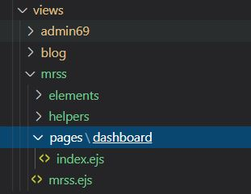
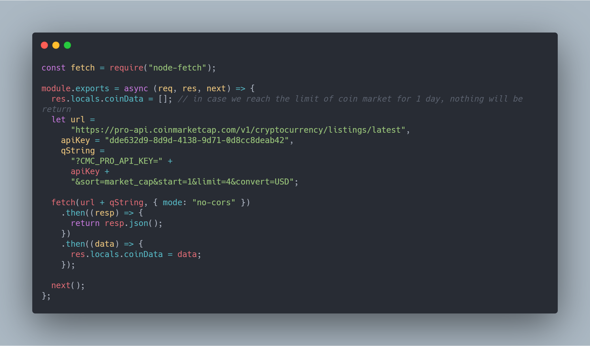
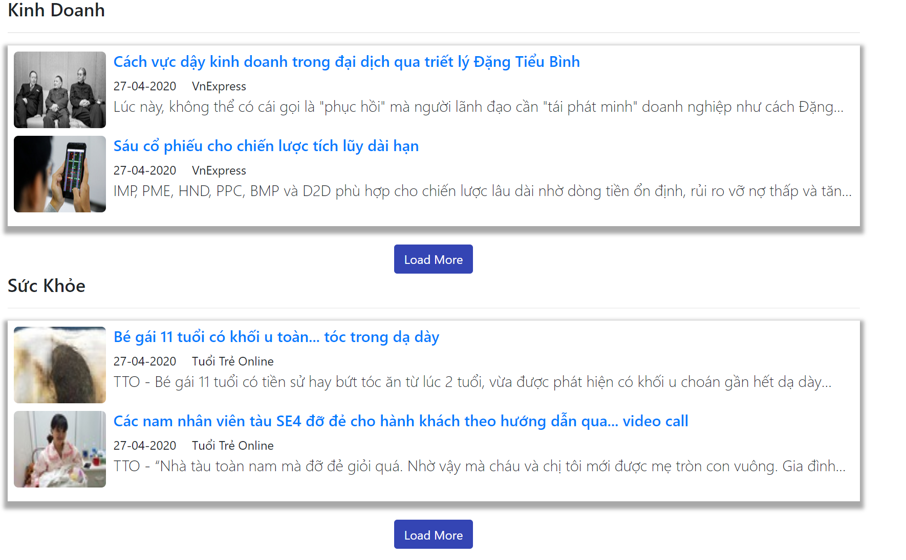

#I. Cấu hình chung

**1. Configs folder**

File configs > database.js

Tạo 2 collections mới để tương tác với database MongoDb

```javascript
col_rssCategory: "rssCategories",
col_rssSources: "rssSources",
```

File configs > system.js

Tạo 1 biến mới prefixMRSS để tương tác với module mới RSS
 
```javascript
prefixMRSS: "mrss",
```
**2. Schemas folder**

File Schemas > rssCategory.js

Định nghĩa cột và kiểu dữ liệu cho RSS Category


File Schemas > rssSources.js

Định nghĩa cột và kiểu dữ liệu cho RSS Source, ở đây thì mình thêm 1 cột rss link kiểu string để chứa đường link tới rss


**3. Models folder**

File rssCategory.js

Ở đây mình định nghĩa các thao tác trên RSS Category, dựa trên schema đã tạo ở trên.
Đa phần thì dùng 2 hàm chính, 1 cho backend để quản lí, 1 cho frontend


Và làm tương tự cho rssSources.js

#II Phần Backend

**1. routes / backend**

Mình tạo 1 file mới rssCategory để xử lí việc lưu trữ categry cho RSS.
Ở đây thì mình lưu giữ lại hầu hết các tính năng sẵn có của 1 item quản lí thông thường 

Và làm tương tự cho rssSource.

**2. view / admin**

Sửa view / admin / elements / navbar-default.ejs
Tạo thêm 2 links, RSS Category và RSS Source để có thể truy xuất khi chúng ta đang ở backend


Ở view / admin / pages 
Mình tạo 2 thư mục rssCategory, và rssSource
Mỗi folder sẽ có 1 file form và list tương ứng với add new / edit, và liệt kê danh sách.


#III Phần Frontend

**1. Layout exercise**

Ở views folder, mình tạo 1 thư mục mới *mrss* và file *mrss.ejs* 


Ở routes folder, mình tạo 2 file, index.js và dashboard.js

*index.js*

 

*dashboard.js*
 

2 files này đảm nhiệm vai trò là khi người dùng truy cập vào đườnh link http://localhost:6969/mrss thì layout MRSS của mình sẽ hiện ra,
cùng với rss category và rss source mà mình đã tạo ra trước đó ở phần backend

**2. Box Coin và SJC**

***a. Coin***

Cái này thì mình dùng api của coinmarketcap để lấy dữ liệu về, dùng module node-fetch (tương tự như fetch trên web api)

File middleware / getCoin
 

Sau đó thì chèn middle này ở phần route / mrss / index.js thì sẽ truy nhập được res.locals.coinData

***b. SJC***

Mình làm tương tự cho SJC, lấy dữ liệu về từ http://www.sjc.com.vn/xml/tygiavang.xml sau đó xữ lí chuỗi xml với package xml2js, lấy 4 items đầu tiên
từ Hồ Chí Minh

File middleware / getSJC
 

Sau đó thì ở views / elements / navbar.ejs , mình tạo 2 functions để hiển thị sjc và coin ra trang mrss.
 

 

**3. Show Articles**

Ở routes / mrss / dashboard.js
Mình sửa phần route.get("/", function()) để duyệt qua các *active* rssCategory, sau đó duyệt qua *active* rssSources trong các category này, ứng với 1 source mình sẽ có 1 link, từ link này mình dùng thư viện rss-parser để lấy dữ liệu về, sau đó đẩy vào 1 array rssSources cho res.render()

  

Sau khi mình có rssCategory và rssSources ở res.render(), mình tạo 1 file index.js ở views / mrss / pages / dashboard để hiện ra các bài viết này

File index.ejs
  

  

Lúc này ở phần front end thì các bài viết sẽ hiện ra
   

*- Xử lí nút <span style="color:red">Fetch More</span>*
Ở views / mrss / pages / dashboard / index.js
Mình thêm 1 nút ở dưới mỗi bài viết

Button này có dạng 


Và thêm phần xử lí ở phía client

Thứ tự của việc làm này là:
+ Phía người dùng bấm vào nút Fetch More, ở client sẽ gửi 1 yêu cầu "POST" về phía server, URL là URL đến từ button
+ Phía server nhận yêu cầu từ client, tìm trong routes mà nó match, từ URL này mình sẽ lấy được RSS Category
+ Từ RSS Category mình lấy được rssSources và những sub link, sau đó trả về phía client dùng **res.json(data)**

Mình làm các thao tác trên thông qua 2 file
Ở phần route, mình thêm phần xử lí khi button này được click


Ở phía client, file public / mrss / js / custom.js


Trong hàm này thì mình xử lí các trường hợp:
```
/*
rssSources có dạng:
rssSources 
    ----- link 1 ->  sub links
    ----- link 2 ->  sub links
    dùng index để kiểm tra là các link đã đc duyệt qua hết
    dùng i để kiểm tra là các sub link đã đc duyệt qua hết

*/

1. nếu ko còn post nào để hiện ra cho category này
if ( i == items.length - 1 && index === rssSources.length - 1 ) {
        let position = $(thisElement).offset();
        createToast(position, "No more post to feed");        
    }

2. nếu post lấy về mà đã được hiện ra trước đó rồi thì mình bỏ qua
if (hrefs.some((href) => href == items[i].link)) continue;

3. nếu post lấy về mà ko trùng với từ khóa thì mình bỏ qua
if (
  items[i].title
    .toUpperCase()
    .includes(params.keyword.toUpperCase()) == false
)
    continue;

4. chỉ lấy 2 bài tiếp theo    
if (count === 2) break;
```

**4. Search**

Trước tiên thì mình tạo search section ở navigation

File views / mrss / elements / navbar.ejs

Thêm hàm xử lí hiện khung search ở navigation sidebar
   

File views / mrss / helpers / handleRenderSearch.ejs

Dùng phương thức GET cho form
   

File này có nhiệm vụ là đẩy keyword mà người dùng gõ trong input, lên trên đường dẫn url, có dạng mrss/?keyword=""

Lúc này ở trong route, mình có thể lấy được cái từ khóa keyword thông qua **req.query**, từ đây mình chỉ việc đẩy cái query này vào res.render để lọc những bài viết liên quan đến từ khóa này thôi.

File routes / mrss / dashboard.js 


Sau đó quay lại hàm handleRenderListRSS ở trên, thêm điều kiện là nếu trong tựa đề bài viết mà có chứa keyword này thì mình sẽ hiện bài viết ra, còn nếu ko thì sẽ ko hiện.

File views / mrss / helpers / handleRenderListRSS.ejs
   

*---- Xử lí chuỗi keyword <span style="background:yellow">highlight</span>*

Trước tiên mình làm 1 hàm highlightText.ejs
  

Hàm này sẽ thay thế chuỗi mà trùng với từ khóa, bằng 1 chuỗi tương tự với 1 css riêng biệt
Sau đó ở phần hiện tiêu đề hoặc là miêu tả của bài viết, mình chèn hàm này vào.
   

Kết quả là từ khóa tìm kiếm sẽ được highlight


**5. Filter Đã xem, chưa xem**

Trước tiên mình thêm section *Đã xem chưa xem* ở sidebar


Ở thẻ anchor, mình dùng url có dạng filter/read hoặc filter/unread và kèm theo keyword của phần search SAI

*- Đánh dấu bài viết đã xem*
Mình tạo 1 function check_visited_links()


Mục đích của hàm này là:
+ Tìm tất cả thẻ anchor mà chứa tiêu đề bài viết
+ Trong những link này, tạo 1 function xử lí cho việc khi user bấm vào link này và link này chưa có trong localStorage, thì link sẽ được lưu vào localStorage
+ Sau đó thêm vào cuối thẻ html cha của cái link này, 1 html **span "visited"** với nội dung là Đã xem.

Mình gọi hàm này khi:
+ Trang load xong
+ Khi người dùng bấm vào 1 link bất kì mà chứa tiêu đê
+ Khi người dùng bấm vào Fetch More để đọc thêm bài, thì những bài vừa được load về cũng sẽ được lọc theo đã xem / chưa xem.

Ở public / mrss / js / custom.js


Lúc này những link đã xem sẽ có thêm 1 tag nằm ở bên phải


*- Xử lí button Đã xem, chưa xem*

Sửa button ở trên sidebar


*****Ở cái phần này thì em nghĩ có thể em làm ko đúng yêu cầu của a, ở phần filter này nó chỉ lọc thông qua những bài viết đã được load hiện tại trên trang thôi, chứ ko giữ được cái trạng thái đọc / chưa đọc thông qua URL. Khi bấm vào load more, nó sẽ load bài viết như thường chứ ko giữ trạng thái đã xem / chưa xem.


**5. Filter Category, RSS Sources**

Ở route / mrss / dashboard.js
Dựa vào req.body để mình lấy được những checkbox đã checked từ sidebar


Sửa sidebar phần checkbox để đẩy dữ liệu về server thông qua method POST


Ở sidebar checkbox section thì mình dùng rssCategorySidebar thông qua middleware getRSSCategorySidebar, sau đó so sánh với rssCategories từ route mà render, nếu trùng nhau thì checkbox này sẽ được check ở lần render tiếp theo

Và tương tự cho rssSources.


*- <span style="color:green">Sửa phần Search</span>*

Lúc đầu khi mà mình dùng search với method là GET như ở trên, rồi truy xuất từ khóa tìm kiếm thông qua req.query, thì search function sẽ chạy bình thường, nhưng khi kết hợp với checkbox và search cùng 1 lúc thì có 2 trường hơp:

1. Người dùng chọn checkbox trước, chọn 1 checkbox ngẫu nhiên, sau đó gõ từ khóa, bấm search.
2. Người dùng gõ từ khóa, ko bấm search, chọn checkbox, rồi bấm filter

Thì ở trường hợp 1, do METHOD của search function là GET -> phần req.body sẽ ko có gì dẫn đến checkbox sẽ ko được xử lí
Ở trường hợp 2 thì sẽ chạy đúng.

Nên mình sửa lại phần sidebar, search và checkbox dùng chung form và cùng 1 action, với method là POST


Sau đó ở route, thì mình truy xuất từ khóa thông qua req.body.keyword


Dạ ở phần này thì ko rõ anh hay mấy bạn khác có cách nào giải quyết dễ hơn ko.

